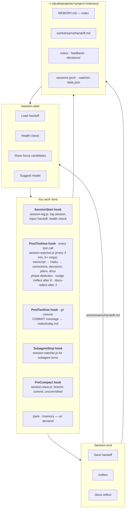

# memory-toolkit

[](https://github.com/IlyaGorsky/memory-toolkit/releases)
[](LICENSE)
[](https://docs.claude.com/en/docs/claude-code)
[](https://github.com/IlyaGorsky/memory-toolkit/commits/main)

**CLAUDE.md is for your codebase. Not for your sessions.**

People stuff session state into CLAUDE.md because there's nowhere else to put it. But CLAUDE.md is static — it doesn't know what you did today, what you decided, or where you stopped. And every conversation context you build up gets destroyed at compaction.

memory-toolkit is the session layer that should have existed alongside CLAUDE.md from the start.

Built for tech leads who run multiple workstreams in parallel.

```bash
claude plugin marketplace add IlyaGorsky/memory-toolkit
claude plugin install memory-toolkit
```

See [INSTALL.md](INSTALL.md) for other methods (local clone for contributors, per-session, manual copy, existing auto-memory migration).

## The problem

Three documented pain points this plugin solves:

**1. Compaction silently destroys context** — you're 4 hours into an auth refactor, compaction fires, and your entire conversation history is compressed into a few paragraphs by a single inference call. Claude Code restores up to 5 recently-read files (50K token budget) — if you read 30 files in those 4 hours, 25 are gone from context. Starting over takes 45 minutes and never fully recovers. ([real report](https://dev.to/gonewx/claude-code-lost-my-4-hour-session-heres-the-0-fix-that-actually-works-24h6))

**2. `--resume` doesn't actually restore context** — `claude --continue` and `claude --resume` start fresh. All accumulated context — files read, decisions made, in-progress work state — is irrecoverable. ([issue #43696](https://github.com/anthropics/claude-code/issues/43696))

**3. Switching between tasks means re-explaining everything** — each context rebuild takes 10–15 minutes. Switching between workstreams multiple times a day compounds into hours of lost time. ([real report](https://dev.to/kaz123/how-i-solved-claude-codes-context-loss-problem-with-a-lightweight-session-manager-265d))

memory-toolkit fixes all three with hooks that fire at the right moment — not at session start.

## Why not just CLAUDE.md?

CLAUDE.md is designed for your codebase — conventions, architecture, commands. It's reloaded from disk on every turn and survives compaction just fine. But it's the wrong tool for session state:

- no structure for "where did I stop", "what did I decide yesterday", "which idea did I park"
- shared and committed — personal session state and team conventions don't belong together
- static by design — it doesn't capture decisions, corrections, or context as you work
- 40KB total limit across all CLAUDE.md levels (managed + user + project + `.claude/rules/*`)

What compaction actually destroys is your **conversation context** — every file Claude read, every decision you discussed, every in-progress plan. CLAUDE.md rules survive; the session doesn't.

memory-toolkit saves the session.

## What this plugin does

- **Session lifecycle** — start, continue, end. Handoff between sessions so you pick up where you left off, not from scratch.
- **Workstreams** — group related memory by project area. Switch context without losing it.
- **Background watcher** — runs on Haiku every 3 minutes, extracts corrections, decisions, and plans from your live transcript into `notes/` as `WATCH:` entries. Raw observations you can see.
- **Docs pipeline** — two separate streams. Watcher observes automatically. When you notice something rule-worthy, mark it explicitly with `DOC:` notation. At `/session-end`, docs-reflect collects your `DOC:` notes and routes them to `.claude/rules/<domain>.md` with your confirmation. You decide what becomes a rule.
- **Model recommendations** — `/session-start` suggests Opus/Sonnet/Haiku per task type. Right model, right cost.
- **Session length nudge** — when the topic shifts mid-session, Claude gently suggests `/session-end`. Semantic signal, not a timer. Save context when a logical unit of work is done — not when compaction forces it.
- **Memory API** — search, filter, query memory from any skill or hook. No vector DB, no external dependencies.

## How it works

### Session lifecycle

```text
 /session-start                                         /session-end
 ├ load handoff                                         ├ save handoff
 ├ health check           YOU WORK HERE                 ├ /reflect
 ├ show focus                                           └ /docs-reflect
 └ suggest model                                              │
       │                                                      │
       ▼                                                      ▲
 ┌─────────────────────────────────────────────────────────────┘
 │
 │  SessionStart hook
 │    session-log.js: log session, inject handoff, health check
 │
 │  PostToolUse hook (every tool call)
 │    session-watcher.js — every 3 min, 6+ new messages:
 │    transcript → Haiku → corrections, decisions, plans, docs
 │    phase detection (planning → implementation → review → debug)
 │    nudge /reflect after 8 findings, /docs-reflect after 3 DOC
 │
 │  PostToolUse hook (git commit)
 │    COMMIT: <message> → notes/<today>.md
 │
 │  SubagentStop hook
 │    session-watcher.js — same, for subagent turns
 │
 │  PreCompact hook
 │    session-save.js: auto-save branch, commit, uncommitted
 │
 │  /park — save idea    /memory — search, list, query
 │
 └──────────────────────────────┐
                                ▼
 ~/.claude/projects/<project>/memory/
 ├ MEMORY.md                     ← index (loaded every session)
 ├ workstreams/handoff.md        ← global handoff (last session, any workstream)
 ├ workstreams/<name>/handoff.md ← per-workstream handoff, routed by /session-end
 ├ notes/<today>.md              ← daily notes (auto + manual)
 ├ feedback/ decisions/ reference/
 ├ sessions.jsonl                ← session ID index
 └ .watcher-state.json           ← phase, counters
```

<details>
<summary>Visual diagram (Mermaid — renders on GitHub)</summary>



</details>

### Use case 1: Context survives compaction

Without plugin:

```text
you ──→ work 2h ──→ [compact] ──→ "wait, what were we doing?"
```

With plugin — PreCompact hook fires before compaction:

```text
you ──→ work 2h ──→ [PreCompact hook] ──→ [compact] ──→ next session
                            │                                 ▲
                            ├──→ workstreams/handoff.md       │
                            │    (session_id, branch,         │
                            │     last commit, uncommitted)   │
                            └──→ notes/<today>.md             │
                                                              │
                  SessionStart hook reads handoff ────────────┘
                  "here's where we left off"
```

### Use case 2: Background watcher captures decisions automatically

While you work, `session-watcher` runs every 3 minutes in the background:

```text
PostToolUse hook fires
      │
      ▼
session-watcher reads new transcript messages (min 6 new messages)
      │
      ▼
Haiku analyzes: corrections / decisions / plans
      │
      ├──→ "WATCH:DECISION: switched to JWT for stateless sessions"
      └──→ "WATCH:CORRECTION: use integration tests, not mocks"

saved to notes/ automatically — no manual effort
```

Two equal paths: `ANTHROPIC_API_KEY` (pay-per-call, ~$0.01–0.05/session) or `claude` CLI with Max/Team subscription (schema-enforced structured output via `--json-schema`, no extra cost). Both produce the same findings.

### Use case 3: Switching between workstreams

```text
Mon  /session-start auth-refactor
       ├── loads decisions/auth-token-format.md
       ├── loads feedback/no-mocks-in-tests.md
       └── /session-end ──→ workstreams/auth/handoff.md (routed by activity)
                       ──→ workstreams/handoff.md (global summary + cross-refs)

Tue  /session-start billing
       ├── loads billing context
       └── workstreams/auth/handoff.md untouched

Thu  /session-continue auth-refactor
       └── reads workstreams/auth/handoff.md — picks up exactly where auth stopped
```

### Use case 4: Session findings become repo documentation

During work, mark documentation-worthy insights inline:

```text
/memory note "DOC: testing — integration tests must hit real DB, not mocks"
/memory note "DOC: architecture — webhook handlers must be idempotent"
```

At `/session-end`, docs-reflect collects DOC: notes, generalizes them into rules, and routes to the right file:

```text
DOC: testing  ──→ .claude/rules/testing.md
DOC: api      ──→ .claude/rules/api.md
DOC: arch     ──→ .claude/rules/architecture.md
```

Also scans `feedback/` for recurring corrections (appeared 2+ times) — strong candidates for `.claude/rules/`.

### Use case 5: Model recommendations per task

`/session-start` suggests the right model for each candidate task:

```text
Focus candidates:
1. Auth refactor — design phase     → Opus    (exploration needed)
2. Implement JWT middleware          → Sonnet  (execution from clear spec)
3. Translate error messages          → Haiku   (cheap, rules sufficient)
```

### Use case 6: Agent crashed mid-plan — recover exactly where it stopped

You had a multi-step plan running. Claude was reading design tokens from Figma to generate components — file read fails, Claude retries, fails again. Infinite loop. Session hangs and dies.

New session: Claude has no idea what's already generated, what's partially done, what failed. It starts over and duplicates or breaks what was already working.

`/session-restore` parses `.jsonl.bak` — the full transcript before the crash — and rebuilds the chronology:

```text
/session-restore restore <uuid>
   └── Block 1: planned component generation
       Block 2: generated Button, Input, Select
       Block 3: reading Figma tokens ← crashed here (read error loop)
       
       Last tool call: Read figma-tokens.json (failed)
       Uncommitted: 3 files
```

You see exactly where the agent died and whether the partial work is safe to continue from or needs a rollback.

### Use case 7: Every session is reachable from any session

```text
SessionStart hook (fires automatically)
   ├──→ notes/<today>.md
   │    "14:30 SESSION_START uuid:a1b2c3 branch:main transcript:..."
   └──→ sessions.jsonl  (searchable index)

/session-restore list               → all sessions with dates, branches, UUIDs
/session-restore search "why PostgreSQL" → greps across .jsonl transcripts
/session-restore restore <uuid>     → rebuilds timeline of that session
/session-insights                   → patterns: "auth tests failed 3× this week"
```

### Memory structure

```text
~/.claude/projects/<project>/memory/
├── MEMORY.md            ← index (loaded into every session)
├── workstreams.json     ← workstream definitions
├── sessions.jsonl       ← session ID index (auto, from hooks)
├── .watcher-state.json  ← background watcher state (offset, lastRun)
│
├── feedback/            ← corrections, confirmed approaches
├── decisions/           ← architectural choices with reasoning
├── reference/           ← external links, dashboards
├── notes/               ← daily notes (auto: hooks + watcher + /park)
├── profile/             ← (optional) user role, preferences
└── workstreams/
    ├── handoff.md       ← global handoff (last session, any workstream)
    └── <name>/
        └── handoff.md   ← per-workstream handoff, written by /session-end
```

All files are markdown. Human-readable, git-friendly, portable.

## Skills

| Skill | What it does |
|-------|-------------|
| `/session-start` | Cold start — load context, show status, model recommendation per task |
| `/session-continue` | Resume a workstream from where you left off |
| `/session-end` | Handoff → reflect → docs-reflect cascade, confirmation at each step |
| `/memory` | Search, list, query memory files. Auto-initializes on first use |
| `/memory-setup` | Initialize or upgrade memory for a project |
| `/park` | Save an idea for later without losing the thought |
| `/reflect` | Session reflection — workarounds, gaps, insights → backlog.md |
| `/session-insights` | Extract patterns from .jsonl session backups |
| `/session-restore` | Recover context from past sessions, search transcripts |
| `/docs-reflect` | Generalize DOC: notes into `.claude/rules/` and `docs/` |

All skills available with namespace prefix: `/memory-toolkit:session-start`, etc.

## Hooks

| Event | Action |
|-------|--------|
| **SessionStart** | Log session, inject handoff context, run memory health check, display DOC: reminder |
| **PostToolUse** (git commit) | Log commits to daily notes |
| **PostToolUse** (all tools) | Background watcher — extract decisions/corrections/docs via Haiku, detect phase, suggest /reflect |
| **SubagentStop** | Same watcher for subagent turns |
| **PreCompact** | Auto-save session state (branch, commit, uncommitted files) before compaction |

## How it compares

**[claude-mem](https://github.com/thedotmack/claude-mem)** — automatically captures everything Claude does, compresses with AI, injects into future sessions. Full automation, web viewer. Trade-offs: SQLite, background worker daemon, **AGPL 3.0**.

**[MemPalace](https://github.com/milla-jovovich/mempalace)** — semantic search across conversations with 96.6% LongMemEval score. Best for "find what we discussed 3 months ago". Trade-offs: Python, ChromaDB, `pip install`.

**[claude-memory-compiler](https://github.com/coleam00/claude-memory-compiler)** — Karpathy's LLM Wiki applied to Claude Code sessions. Compiles sessions into structured knowledge articles. Trade-offs: Python, uv, Claude Max/Team subscription, $0.45–0.65 per compile.

**memory-toolkit** solves a different problem: **session workflow + real-time capture**. No daemon, no DB, MIT license.

| | claude-mem | MemPalace | claude-memory-compiler | memory-toolkit |
|---|---|---|---|---|
| Problem solved | "What did Claude do?" | "What did we discuss?" | "What did we learn?" | "Where did I stop?" |
| Storage | SQLite + AI | ChromaDB | Markdown articles | Markdown files |
| Dependencies | Node.js, SQLite, worker | Python, ChromaDB | Python, uv | None (built-in Node.js) |
| Requires subscription | No | No | Claude Max/Team | No (Haiku API optional) |
| Real-time capture | No | No | No | Yes — Haiku watcher |
| Session lifecycle | No | No | No | Yes — start, continue, end |
| Workstreams | No | Wings/halls/rooms | No | Yes |
| Docs pipeline | No | No | knowledge/ articles | .claude/rules/ routing |
| Model recommendations | No | No | No | Yes — per task type |
| Cost per session | Worker overhead | — | $0.45–0.65 | ~$0.01–0.05 (optional) |
| License | AGPL 3.0 | MIT | — | MIT |

**When to use what:**

- Total recall of everything Claude did, OK with daemon + AGPL → **claude-mem**
- Semantic search across months of conversations → **MemPalace**
- Sessions compiled into growing knowledge base, have Max subscription → **claude-memory-compiler**
- Session continuity, workstreams, real-time capture, docs pipeline, MIT → **memory-toolkit**

They're complementary — memory-toolkit for session workflow, claude-mem or claude-memory-compiler for long-term knowledge.

## Current limitations

- **Background watcher** — requires `ANTHROPIC_API_KEY` or `claude` CLI (Max/Team subscription). No-op if neither is available. Parse-error rate surfaces in `/memory health` if the CLI path degrades.

## Philosophy

No vector DB. No external services. No complex setup.

Markdown files, a Node.js script, a Haiku watcher, and Claude Code skills that know how to use them. Your memory stays on your machine, in a format you can read, edit, and version control.

See [PHILOSOPHY.md](PHILOSOPHY.md) for the full rationale.

## Troubleshooting

If something isn't working, turn on debug logging. Hook scripts (session-log, session-watcher, session-save) emit structured JSON — one line per event, including plugin version, timestamp, and context:

```json
{"ts":"2026-04-12T18:19:32.864Z","v":"1.3.6","level":"debug","msg":"session-log start","sessionId":"abc-123","memoryDir":"/..."}
```

Two ways to see these logs — pick whichever matches how you run Claude Code.

**Option 1 — persistent file sink via `settings.local.json`** (works everywhere: CLI, VS Code extension, remote agents):

```jsonc
// .claude/settings.local.json  (project)  or  ~/.claude/settings.json  (global)
{
  "env": {
    "MT_LOG": "debug",
    "MT_LOG_FILE": "~/.claude/logs/memory-toolkit.log"
  }
}
```

Restart your session so Claude Code picks up the new env. Parent dirs are created automatically; logs are appended (not truncated), so `tail -f` works:

```bash
tail -f ~/.claude/logs/memory-toolkit.log
```

This is the only option that surfaces hook stderr inside the VS Code extension / other embedded harnesses — they swallow child-process stderr, so `2>` redirection from the host shell can't reach it.

**Option 2 — stderr redirect** (CLI only, one-shot debug of a single run):

```bash
MT_LOG=debug claude                   # watch live in terminal
MT_LOG=debug claude 2>mt-debug.log    # capture to file for bug reports
```

`MT_LOG_FILE` and `2>` are additive — setting both writes to the file *and* to stderr.

**For plugin developers:** `MT_LOG=debug` is the primary tool for debugging hook behavior — shows memory dir resolution, AP-20 path updates, watcher throttle decisions, and transcript parsing.

**Common issues:**

| Symptom | Likely cause | Fix |
|---------|-------------|-----|
| Workstreams not found on session start | PROJ_KEY mismatch (dots in username) | Update to v1.3.5+ |
| MEMORY.md shows old version path | AP-20: auto-update not firing | Start a new session — `session-log.js` fixes it |
| Watcher not detecting findings | Transcript not in `sessions.jsonl` | Check `MT_LOG=debug` for watcher throttle/transcript issues |

**Reporting bugs:** open an issue at [IlyaGorsky/memory-toolkit](https://github.com/IlyaGorsky/memory-toolkit/issues) with:
1. Plugin version (`claude plugin list`)
2. Debug log (`MT_LOG=debug claude 2>mt-debug.log`)
3. What you expected vs what happened

## FAQ

### Does it conflict with Claude Code auto-memory?

No — they collaborate. CC auto-memory writes to `MEMORY.md` based on user facts; memory-toolkit handles session-level state (handoffs, workstreams, DOC: notes). They edit different parts of the file and coexist via a shared index.

### Where is my memory stored?

`~/.claude/projects/-<project-slug>/memory/`. Fully local filesystem. Nothing leaves your machine unless you enable the optional watcher with an API key.

### Does anything get uploaded?

By default — no. Memory stays on your disk. The optional `session-watcher` hook can analyze conversation chunks via Haiku (either your `ANTHROPIC_API_KEY` or via the `claude -p` CLI subprocess) — and that's the only outbound traffic. Disable the watcher by removing it from `hooks.json` if you want zero network.

### Can I use it without hooks?

Yes. The CLI (`node memory.js …`) works standalone — hooks are a convenience layer for auto-save. You can invoke skills manually (`/session-start`, `/memory note`, etc.) and never register a single hook.

### Does it slow down my session?

- `session-log` / `session-save` — under 500 ms
- `session-watcher` — throttled to once per 3 min, runs async, never blocks
- `pipeline-hint` — disabled by default

Invisible in practice on a modern laptop.

### Does it work for teams or shared memory?

No — designed for personal sessions. Memory dir is per-user, per-project. Team-level memory is on the research roadmap, not shipped.

### How do I uninstall?

`claude plugin uninstall memory-toolkit`. Your memory files in `~/.claude/projects/*/memory/` stay — delete them manually if you want a full wipe.

## License

MIT
